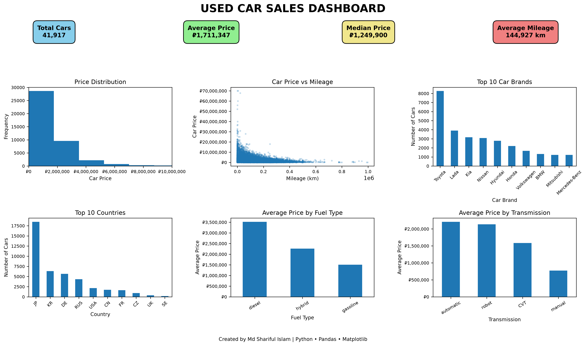

# 🚗 Used Car Sales Analysis Dashboard | Python


## 📑 Table of Contents

- [Dashboard Preview](#-dashboard-preview)
- [Project Summary](#-project-summary)
- [Dataset Overview](#-dataset-overview)
- [Business Objectives](#-business-objectives)
- [Key Insights](#-key-insights)
- [Dashboard Features](#-dashboard-features)
- [Technologies Used](#-technologies-used)
- [Files](#-files)
- [How to Run](#-how-to-run)
- [Future Improvements](#-future-improvements)
- [Contact](#-contact)
- [Author](#-author)

## 📋 Project Summary

This project presents a comprehensive exploratory data analysis (EDA) and business intelligence dashboard built using Python. The analysis is based on a real-world used car marketplace dataset covering **more than 41,900 vehicle listings across 24 cities in Russia**.

The primary objective is to transform raw vehicle listing data into meaningful business insights through data cleaning, statistical analysis, and professional data visualization.

**All financial analyses and dashboard metrics are presented in Russian Rubles (₽), reflecting the original currency of the dataset.**

---

## Dashboard Preview



# 🎯 Business Objectives

This analysis was conducted to answer several important business questions:

- What is the overall distribution of used car prices?
- How does vehicle mileage influence selling price?
- Which car brands dominate the Russian used car market?
- Which countries manufacture the most listed vehicles?
- How do fuel types affect vehicle pricing?
- How does transmission type influence average selling price?
- What key performance indicators (KPI) best summarize the used car market?

---

# 📊 Dataset Information

**Dataset Characteristics**

- Over **41,900** used vehicle listings
- Covers **24 cities across Russia**
- Original prices recorded in **Russian Rubles (₽)**
- Cleaned and prepared for business analytics

### Dataset Features

- Car Brand
- Manufacturing Country
- Selling Price (₽)
- Mileage (km)
- Fuel Type
- Transmission
- Vehicle Age
- Additional vehicle specifications

---

# 🛠 Tools & Technologies

- Python
- Pandas
- NumPy
- Matplotlib
- Jupyter Notebook
- Visual Studio Code
- Git
- GitHub

---

# 🧹 Data Preparation

Before analysis, the dataset underwent several preprocessing steps:

- Removed duplicate records
- Checked and handled missing values
- Removed unnecessary columns
- Renamed columns for consistency
- Exported a cleaned dataset for analysis
- Verified data integrity

---

# 📈 Dashboard KPIs

The executive dashboard summarizes the market using four key metrics:

- 🚗 Total Number of Cars
- 💰 Average Selling Price (₽)
- 📊 Median Selling Price (₽)
- 🛣 Average Vehicle Mileage (km)

---

# 📉 Dashboard Visualizations

The dashboard contains multiple analytical visualizations:

### Price Distribution

Shows the distribution of vehicle prices and highlights luxury vehicle outliers.

### Price vs Mileage

Illustrates the negative relationship between mileage and selling price.

### Top 10 Car Brands

Displays the brands with the highest number of vehicle listings.

### Top 10 Countries by Number of Cars

Shows the manufacturing countries most represented in the Russian used car market.

### Average Price by Fuel Type

Compares average vehicle prices across diesel, gasoline, and hybrid vehicles.

### Average Price by Transmission

Analyzes pricing differences between automatic, CVT, robotic, and manual transmissions.

---

# 💼 Business Insights

Key findings from the analysis include:

- Toyota has the highest number of used vehicle listings.
- Diesel vehicles command the highest average selling price.
- Automatic transmission vehicles generally achieve higher market prices than manual vehicles.
- Vehicle prices decrease as mileage increases, indicating a clear negative relationship.
- Luxury vehicle outliers significantly increase the overall average price, making the median a better measure of central tendency for pricing analysis.

---


# 📂 Project Structure

```
Project Python/
│
├── car-data-original.csv
├── car-data-cleaned.csv
├── used-car-sales-analysis.ipynb
├── used-car-sales-dashboard.png
├── README.md
└── LICENSE
```

---

# 📚 Skills Demonstrated

This project demonstrates practical experience in:

- Data Cleaning
- Exploratory Data Analysis (EDA)
- Statistical Analysis
- Business Intelligence
- Dashboard Development
- Data Visualization
- Python Programming
- Git & GitHub
- Business Insight Generation

---

# 🚀 Future Enhancements

Potential future improvements include:

- Interactive Plotly Dashboard
- Power BI Version
- Machine Learning Price Prediction Model
- Time-Series Market Analysis
- Interactive Filtering and Drill-Down Visualizations

---

## 👤 Author

**Md Shariful Islam**

Aspiring Data Analyst specializing in SQL, Python, Power BI, and Data Visualization.

🐙 GitHub:
https://github.com/Sharifu-Analytics

💼 LinkedIn:
https://linkedin.com/in/Islam-Freelancer

📧 Email:
islam.md@gmail.com
---

## Disclaimer

This project was developed solely for educational and portfolio purposes. The dataset represents historical used vehicle listings from **24 cities across Russia**, and **all monetary values are reported in Russian Rubles (₽)** to preserve the original financial context of the data.

---

⭐ If you found this project useful, please consider giving it a star on GitHub.
